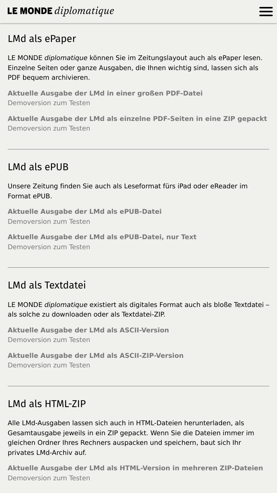
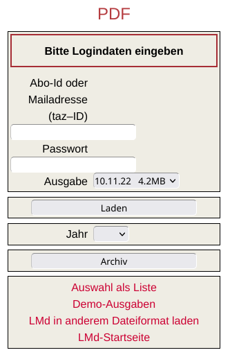
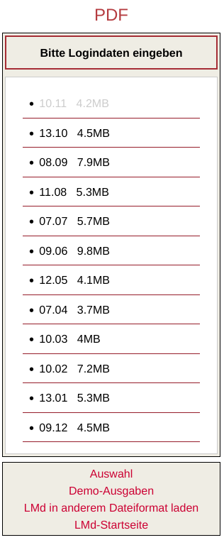

# lmd-dl
A free and open source download manager for subscribers of the German edition of Le Monde Diplomatique.

## Why lmd-dl? 

I enjoy reading (or listening) to the German edition of Le Monde Diplomatique.
However, using the website [https://monde-diplomatique.de/digitale-formate](https://monde-diplomatique.de/digitale-formate)
in order to download the latest issues in my preferred file formats is not enjoyable at all. 
The software `lmd-dl` tries to make LMD subscriptions more user friendly. 

## Get lmd-dl

You can clone the repository from Github:
```
git clone https://github.com/hollma/lmd-dl.git
```

## Usage

Firstly, edit `src/config.ini`.
Initially, the config looks like this:

```
[CREDENTIALS]
username = change_me
password = change_me

[FORMATS]
pdf    = yes
pdfz   = yes
epub   = yes
epubt  = yes
ascii  = yes
asciiz = yes
html   = yes
mp3    = yes

[PATHS]
cache_dir  = /path/to/the/cache/directory
output_dir = /path/to/the/output/directory

[DOWNLOAD_OPTIONS]
issue_count = 1
```

Replace `username` and `password` with your credentials.
Moreover, enter valid directory paths in the `PATHS` section.
Modify the remaining options according to your own preferences.

Run `python3 src/lmd-dl.py -h` in order to show the help option.

If everything is set up, run `python3 src/lmd-dl.py` in order to download the most recent issues of 
Le Monde Diplomatique to the cache directory (see `src/config.ini`). 

### TODO
- further processing of the cached files (extract zip files, ...)

## Technical background

Downloading the latest LMD issue works like this.

You visit the website [https://monde-diplomatique.de/digitale-formate](https://monde-diplomatique.de/digitale-formate).



Then you choose your preferred file format, for example, PDF.



If you click on "Auswahl als Liste" you will see a list of the latest issues.


   
Downloading an issue works like this. You send a HTTP POST request to the server. The request contains POST variables such as:
- username
- password
- filename of the issue you are about to download
- `Laden=+Laden+`
- and `year=`.

The server's response contains the requested file. 
Now you choose a directory for saving the file (or your browser does it for you).

The goal of `lmd-dl` to automate this process. 